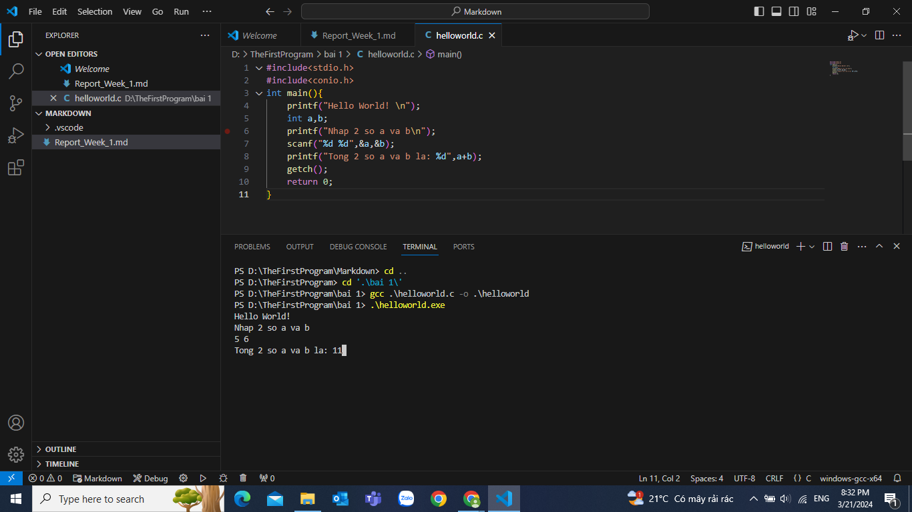

<!--
File: readme.md
Author: [Your Name]
Created on: [Date]
Description: [Brief description of the file's purpose]
-->

## Important: Please Add Your Own Report

Welcome to your report file. In the next section, please add your own report below. You can include your analysis, findings, and any relevant information.

Make sure to add your information to the begining of this file.

### Weekly Task Description

You can find the detailed description of the weekly task in the file: [task_description.md](task_description.md).

### Revision Task

For the revision task, please refer to: [revision.md](revision.md).

---

# Week 1 Report
# Week 1
---
## **Task**
* ~~**Done được 3 bài đầu của Học C bá đạo.**~~
* ~~**Cài được VS Code.**~~
* ~~**Hiểu được thế nào là môi trường (environment) và tại sao cần thêm biến môi trường (environment variable).**~~
* ~~**Cài và sử dụng trình biên dịch gcc.**~~
* ~~**Biên dịch và chạy code bắt buộc phải dùng dòng lệnh (gõ lệnh vào terminal)**~~
---

## 1. **Run code in terminal**
- **To run code in terminal we use cmd line:**
 gcc /file_name.c/ - o /file_name/

- **Useful cmd**
  - **pwd\:** printing directory
  - **\-o \<file name>\:** place output into file
  - **cd\:** changing directory
  - **dir\:** listing folder in working directory.
  - **gcc --help\:** show more gcc functions
## 2. **Environment\:** 
- **Definition\:** the context in which code is being executed—all the variables, objects, functions available to the code. We can think of an environment as a unique machine executing code.
- **Types\:**
    - **Development Environment\:** where application/system development tasks, such as designing, programming, debugging, etc., take place.
       - **SDE( software development environment)\:** a collection of hardware and software tools a system developer uses to build software systems.
        - **IDE (integrated development environment)\:** integrating common development tools in a single software environment. (including features: File system, Text editor, Linker, Compiler, Integrated tools,...)
   - **Test Environment\:**  where application testing is conducted to find and fix errors.
   - **Staging Environment\:** where all the work done in the development environment is merged into the built system (often used to automate the process of software compilation) before it is moved into the production environment.
   - **Production Environment\:** where new builds/updates are moved into production for end users. 
## 3. **Environment Variables\:** 
- **Definition\:** determined values to provide the ability that can affect the way programs, applications and services will behave. These values are dynamic and can be changed based on the environment that your program is running in. 
- **Types\:** 
    - **System environment variables\:** variables that are applied for the whole system. ( Ex\: TMP )
    - **User environment variables\:** variables having values specific to programs installed only for specific users. (Ex\: LANG)
    - **Runtime/ process environment variables\:** values coming into play during execution. For example, it could determine the time of users in a game,...
- **Function\:**
  - Can set up different configuration options for environments.
  - Used to communicate to programs how the machine is set up
  - Can control the behavior of programs
  - Can store sensitive information (passwords,...)
  - Can be dynamic values that can be accessed even during runtime.
